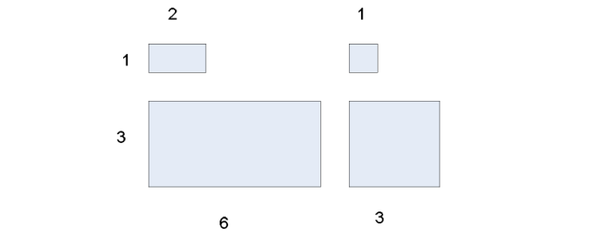
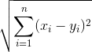

### Problem 2: Exploring Data Preprocessing Techniques (26 points) 
 
***Read the solution post of the Kaggle Titanic Dataset:***

. 

Run the code and reproduce the data preprocessing and classification modeling steps.  
 
- `Q1 (Reproduce): Please read, understand, run the code and reproduce the model accuracies. Please briefly explain whether you can reproduce the classification accuracies of  'Support Vector Machines', 'KNN', 'Logistic Regression',  'Random Forest', 'Naive Bayes', 'Perceptron', 'Stochastic Gradient Decent', 'Linear SVC', 'Decision Tree'. (10 points)`
 
- `Q2 (Improve): Is the data preprocessing process proposed in the Kaggle post the best preprocessing solution? If yes, please explain why. If not, can you leverage what you learned in the class and your previous experiences to improve data processing, to obtain better accuracies for all these classification models? Describe what is your improved data preprocessing, and what are your improved accuracies?  (16 points)`

### Problem 3: Distance/Similarity Measures (10 points)

Given the four boxes shown in the following figure, answer the following questions.

- In the diagram, numbers indicate the lengths and widths and you can consider each box to be a vector of two real numbers, length and width. For example, the top left box would be (2,1), while the bottom right box would be (3,3).  Restrict your choices of similarity/distance measure to Euclidean distance and correlation.  Please explain your choice.

#### Euclidean distance:
- `The Euclidean distance is a distance measure between two points or or vectors in a two- or multidimensional (Euclidean) space based on Pythagoras' theorem. The distance is calculated by taking the square root of the sum of the squared pair-wise distances of every dimension.`

 
 #### Pearson correlation:
 - `The Pearson correlation coefficient is probably the most widely used measure for linear relationships between two normal distributed variables and thus often just called "correlation coefficient". Usually, the Pearson coefficient is obtained via a Least-Squares fit and a value of 1 represents a perfect positive relation-ship, -1 a perfect negative relationship, and 0 indicates the absence of a relationship between variables.`
 

            

 

            

